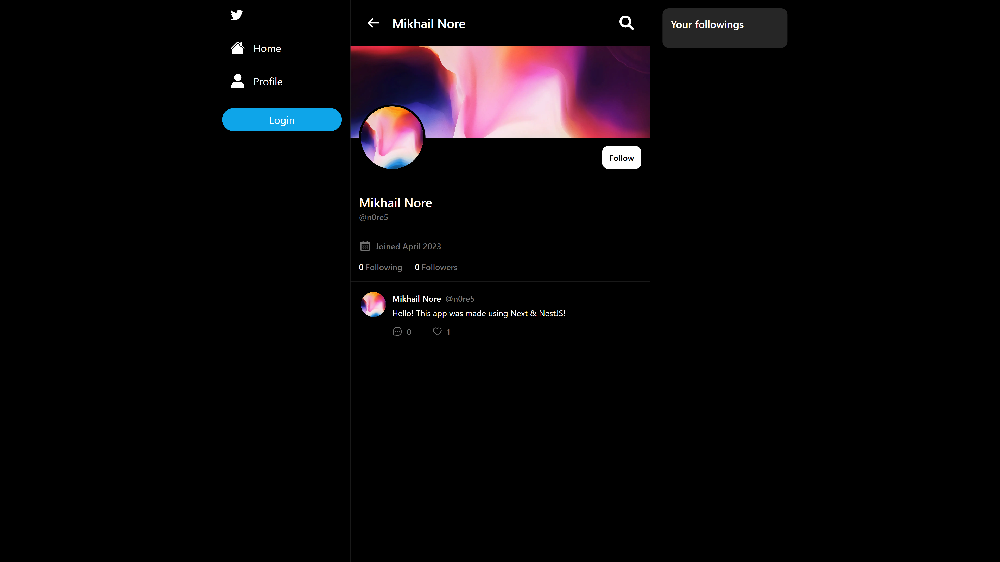
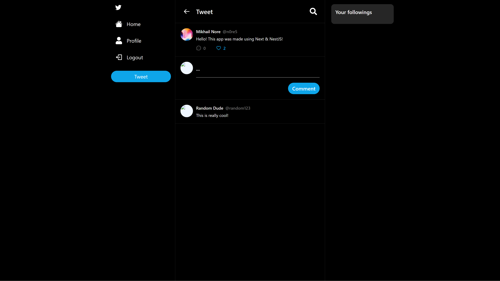
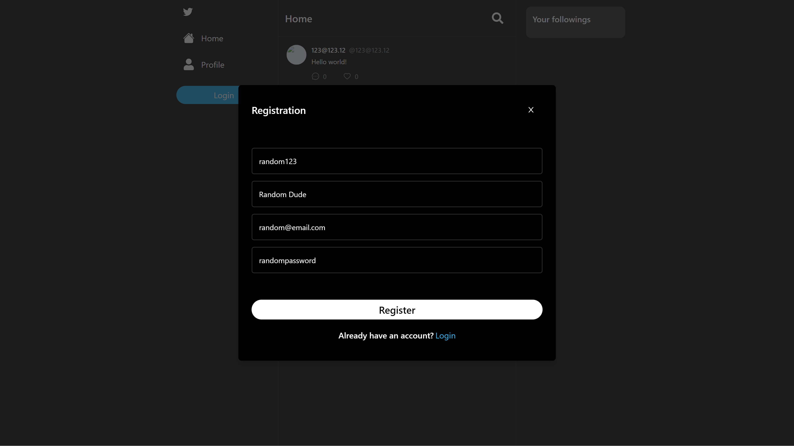

twitterclone
========
Twitter clone is a fullstack web application that is made with NextJS + NestJS 

Gallery
------------------

Table of Technologies
------------------
1. NextJS (React SSR Framework)
2. NestJS (Backend Framework)
3. NodeJS
4. PostgreSQL (DB)
5. TailwindCSS (preprocessor)
